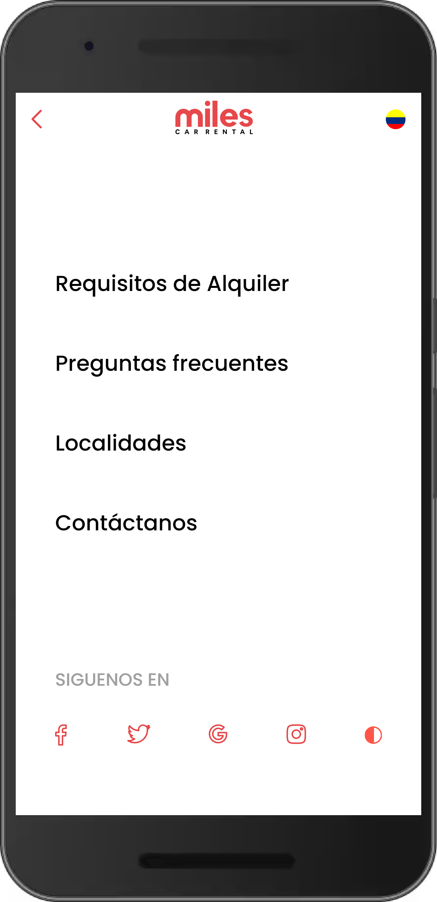

<br/>

<p align="center">
  <h3 align="center">Prueba Técnica - Browser Travel Solutions</h3>

  <p align="center">
    • Miles Car Rental v1.0 •
    <br/>
    <br/>
    <a href="https://github.com/js-toro/miles-car-rental"><strong>Ir a la repositorio»</strong></a>
    <br/>
    <br/>
    <a href="https://milescarrental.netlify.app">Ver demo</a> 
  </p>
</p>

<h2> Tabla de contenido</h2>

- [Acerca del proyecto](#acerca-del-proyecto)
  - [Requisitos de la prueba](#requisitos-de-la-prueba)
- [Tecnologías usadas](#tecnologías-usadas)
- [Getting Started](#getting-started)
  - [Prerequisitos](#prerequisitos)
  - [Instalación](#instalación)
- [Otros proyectos](#otros-proyectos)

## Acerca del proyecto

El presente proyecto responde a la prueba técnica de Browser Travel Solutions para el rol de Maquetador | Desarrollador Frontend. 

Se adjuntó un archivo Adobe XD el cual contenía el mockup del home para la aplicación web miles car rental. Basado en ese mockup se construyó el respectivo HTML de la aplicación.

<table align="center">
  <tr>
    <th>
    <p align="center">Diseño</p>
    </th>
    <th></th>
    <th>
    <div align="center">Maquetado</div>
    </th>
  <tr>
 <tr>
    <td>
    
    </td>
    <td>vs</td>
    <td>
    
    </td>
  <tr>
  <tr>
    <td>
    
    </td>
    <td>vs</td>
    <td>
    
    </td>
  <tr>
</table>

### Requisitos de la prueba

Se debe tener en cuenta los siguientes requisitos para construir la interfaz.

- El proyecto se debe montar con React.js.
- Crear componentes reutilizables.
- Estructura HTML5.
- Los estilos deben ser montados en Styled components.
- Los estilos deben estar pensados para no dañar el performance del sitio.
- Todos los elementos del sitio deben ser funcionales.

## Tecnologías usadas

Para la realización de la aplicación se usaron las siguientes tecnologías.<br>


 


## Getting Started

Para poner en marcha una copia local siga estos pasos de ejemplo.

### Prerequisitos

Antes de empezar recomiendo una actualización de npm y así obtener los ultimos paquetes, los usados en este proyecto.

* npm

```sh
npm install npm@latest -g
```

### Instalación

1. Clona el el repositorio

```sh
git clone https://github.com/js-toro/miles-car-rental.git
```

2. Instala los paquetes de NPM

```sh
npm install
```

3. Lanza aplicación en modo local

```sh
npm run dev
```

## Otros proyectos

- Alex Toro Arquitectos • [Live Demo](https://alextoroarquitectos.netlify.app) • [Ver Repositorio](https://github.com/js-toro/alextoroarq) • Proyecto en proceso
- Beatsby Dre • [Live Demo](https://beatsby-dre.netlify.app) • [Ver Repositorio](https://github.com/js-toro/beatsby-dre-landing-page)
